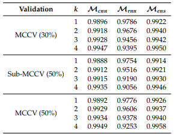
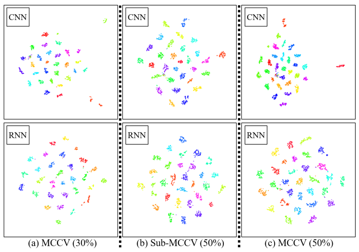

# Can Ensemble Deep Learning Identify People by Their Gait Using Data Collected from Multi-Modal Sensors in Their Insole?
This repository is the official implementation of "Can Ensemble Deep Learning Identify People by Their Gait Using Data Collected from Multi-Modal Sensors in Their Insole?"
# Requirements
To install requirements:
```
pip install -r requirements.txt
```
# Training
The averaging ensemble model utilizes a CNN and a RNN model trained independently. The trained models are saved in folders especified in the source code. The required sequence to train the tri-modal is as follows:
```
cd code/tri-modal
python Experiments_CNN.py
python Experiments_RNN.py
python Experiments_Ensemble.py
```
We repeat the experiment 20 times for each K and for three types of Monte Carlo Cross-Validation (MCCV) methods, which are MCCV (30%), Sub-MCCV, (50%), and MCCV (50%) described in the paper.
For each repetition, our proposed method is trained and tested independently, then the averaged evaluation metrics are summarized.


# Results

Tri-modal performance:



t-SNE:



# Contributors
Nelson Minaya nelson.minaya@student.csulb.edu <br/>
Nhat Le nhat.le01@student.csulb.edu
